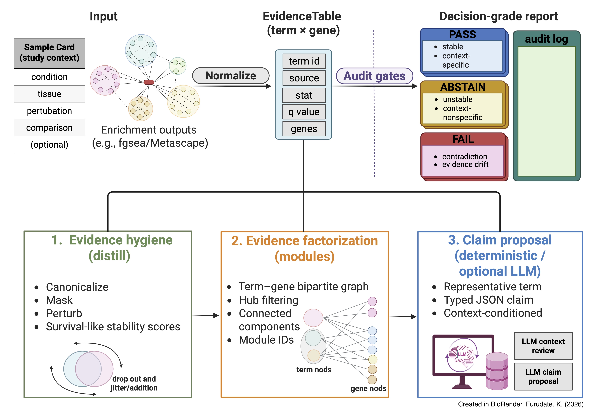

# LLM-PathwayCurator

<p align="left">
  
  <span style="font-size: 28px; font-weight: 700; vertical-align: middle;">
     Enrichment interpretations → audited, decision-grade pathway claims.
  </span>
</p>

[](https://llm-pathway-curator.readthedocs.io/)
[](https://opensource.org/licenses/MIT)
[](https://www.python.org/downloads/)

- **Docs:** https://llm-pathway-curator.readthedocs.io/
- **Paper reproducibility (canonical):** `paper/` (see `paper/README.md`; panel map in `paper/FIGURE_MAP.csv`)

---

## 🚀 What this is

**LLM-PathwayCurator is an interpretation QA layer for enrichment analysis (EA).**  
It **does not** introduce a new enrichment statistic. Instead, it turns EA outputs into **auditable decision objects**:

- **Input:** enrichment term lists (ORA, fgsea/GSEA, etc.)
- **Output:** **typed, evidence-linked claims** + **PASS/ABSTAIN/FAIL** decisions + **reason-coded audit logs**
- **Promise:** we **abstain** when claims are **unstable**, **under-supported**, **contradictory**, or **context-nonspecific**

> **Selective prediction for pathway interpretation:** calibrated abstention is a feature, not a failure.

<p align="center">
  
</p>

---

## 🧭 Why this is different (and why it matters)

Enrichment tools return ranked term lists. In practice, interpretation breaks because:

1) **Representative terms are ambiguous** under study context  
2) **Gene support is opaque**, enabling cherry-picking  
3) **Related terms share / bridge evidence** in non-obvious ways  
4) There is **no mechanical stop condition** for fragile narratives

**LLM-PathwayCurator replaces narrative endorsement with audit-gated decisions.**  
We transform ranked terms into **machine-auditable claims** by enforcing:

- **Evidence-linked constraints:** claims must resolve to valid term/module identifiers and supporting-gene evidence
- **Stability audits:** supporting-gene perturbations yield stability proxies (operating point: **τ**)
- **Context validity stress tests:** context swap reveals context dependence without external knowledge
- **Contradiction checks:** internally inconsistent claims fail mechanically
- **Reason-coded outcomes:** every decision is explainable by a finite audit code set

---

## 🔍 What this is not

- Not an enrichment method; it **audits** enrichment outputs.
- Not a free-text summarizer; **claims are schema-bounded** (typed JSON; no narrative prose as “evidence”).
- Not a biological truth oracle; it checks **internal consistency and evidence integrity**, not mechanistic truth.

---

## 🧩 Core pipeline (A → B → C)

**A) Stability distillation (evidence hygiene)**  
Perturb supporting genes (seeded) to compute stability proxies (e.g., LOO/jackknife-like survival scores).  
Output: `distilled.tsv`

**B) Evidence factorization (modules)**  
Factorize the term–gene bipartite graph into **evidence modules** that preserve shared vs distinct support.  
Outputs: `modules.tsv`, `term_modules.tsv`, `term_gene_edges.tsv`

**C) Claims → audit → report**  
- **C1 (proposal-only):** deterministic baseline or optional LLM proposes **typed claims** with resolvable evidence links  
- **C2 (audit/decider):** mechanical rules assign **PASS/ABSTAIN/FAIL** with precedence (FAIL > ABSTAIN > PASS)  
- **C3 (report):** decision-grade report + audit log + provenance

---

## ⚡ Quick start (library entrypoint)

```bash
llm-pathway-curator run \
  --sample-card examples/demo/sample_card.json \
  --evidence-table examples/demo/evidence_table.tsv \
  --out out/demo/
````

### Key outputs (stable contract)

* `audit_log.tsv` — PASS/ABSTAIN/FAIL + reason codes (mechanical)
* `report.jsonl`, `report.md` — decision objects (evidence-linked)
* `claims.proposed.tsv` — proposed candidates (proposal-only; auditable)
* `distilled.tsv` — stability proxies / evidence hygiene outputs
* `modules.tsv`, `term_modules.tsv`, `term_gene_edges.tsv` — evidence structure
* `run_meta.json` (+ optional `manifest.json`) — pinned params + provenance

---

## ⚖️ Inputs (contracts)

### EvidenceTable (minimum required columns)

Each row is one enriched term.

Required columns:

* `term_id`, `term_name`, `source`
* `stat`, `qval`, `direction`
* `evidence_genes` (supporting genes; TSV uses `;` join)

### Sample Card (study context)

Structured context record used for proposal and context gating, e.g.:

* `condition/disease`, `tissue`, `perturbation`, `comparison`

Adapters for common tools live under `src/llm_pathway_curator/adapters/`.

---

## 🔧 Adapters (Input → EvidenceTable)

Adapters are intentionally conservative:

* preserve **evidence identity** (term × genes)
* avoid destructive parsing
* keep TSV **round-trips stable** (contract drift is treated as a bug)

See: `src/llm_pathway_curator/adapters/README.md`

---

## 🛡️ Decisions: PASS / ABSTAIN / FAIL

LLM-PathwayCurator assigns decisions by **mechanical audit gates**:

* **FAIL**: auditable violations (evidence-link drift, schema violations, contradictions, forbidden fields, etc.)
* **ABSTAIN**: non-specific, under-supported, or unstable under perturbations / stress tests
* **PASS**: survives all enabled gates at the chosen operating point (**τ**)

**Important:** the LLM (if enabled) never decides acceptance.
It may propose candidates; **the audit suite is the decider**.

---

## 🧪 Built-in stress tests (counterfactuals without external knowledge)

* **Context swap**: shuffle study context (e.g., BRCA → LUAD) to test context dependence
* **Evidence dropout**: randomly remove supporting genes (seeded; min_keep enforced)
* **Contradiction injection** (optional): introduce internally contradictory candidates to test FAIL gates

These are specification-driven perturbations intended to validate that the pipeline
**abstains for the right reasons**, with **stress-specific reason codes**.

---

## ♻️ Reproducibility by default

LLM-PathwayCurator is deterministic by default:

* fixed seeds (CLI + library defaults)
* pinned parsing + hashing utilities
* stable output schemas and reason codes
* run metadata persisted to `run_meta.json` (and runner-level `manifest.json` when used)

Paper-side runners (e.g., `paper/scripts/run_fig2_pipeline.py`) **orchestrate** reproducible sweeps
and do not implement scientific logic; they call the library entrypoint (`llm_pathway_curator.pipeline.run_pipeline`).

---

## 📦 Installation

### Option A: PyPI (recommended)

```bash
pip install llm-pathway-curator
```

### Option B: From source (development)

```bash
git clone https://github.com/<ORG>/LLM-PathwayCurator.git
cd LLM-PathwayCurator
pip install -e .
```

---

## 🐳 Docker (recommended for reproducibility)

```bash
docker compose -f docker/docker-compose.yml up -d
docker compose -f docker/docker-compose.yml logs -f --tail=50 llm-pathway-curator
```

(If you publish GHCR images)

```bash
docker pull ghcr.io/<ORG>/llm-pathway-curator:<TAG>
```

---

## 🤖 LLM usage (proposal-only; optional)

If enabled, the LLM is confined to proposal steps and must emit **schema-bounded JSON**
with **resolvable EvidenceTable links**.

Backends (example):

* OpenAI: `OPENAI_API_KEY`
* Gemini: `GEMINI_API_KEY`
* Ollama: `LLMPATH_OLLAMA_HOST`, `LLMPATH_OLLAMA_MODEL`

Typical environment:

```bash
export LLMPATH_BACKEND="openai"   # openai|gemini|ollama
export OPENAI_API_KEY="sk-..."
```

Deterministic settings are used by default (e.g., temperature=0), and runs persist
prompt/raw/meta artifacts alongside `run_meta.json`.

---

## 📄 Manuscript reproduction

`paper/` contains manuscript-facing scripts, Source Data exports, and frozen/derived artifacts (when redistributable).

* `paper/README.md` — how to reproduce figures
* `paper/FIGURE_MAP.csv` — canonical mapping: panel ↔ inputs ↔ scripts ↔ outputs

---

## 🧾 Citation

If you use LLM-PathwayCurator, please cite:

* **Preprint:** *Transforming enrichment terms into audit-gated decision-grade claims with LLM-PathwayCurator*, bioRxiv (2026). DOI: *(to be added)*
* **Software:** LLM-PathwayCurator (v0.1.0). Zenodo. DOI: *(to be added)*

---
